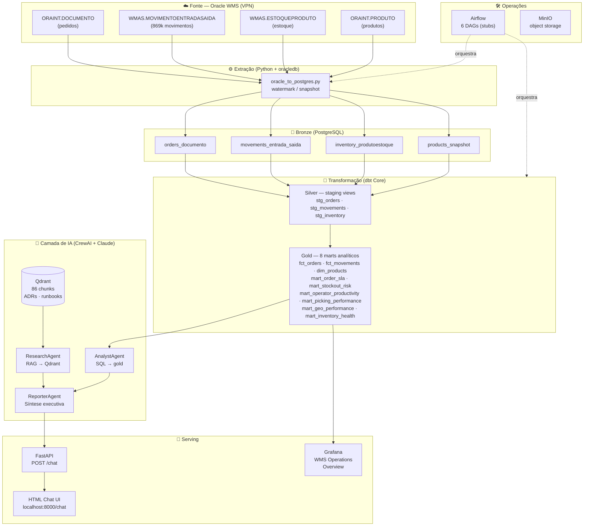
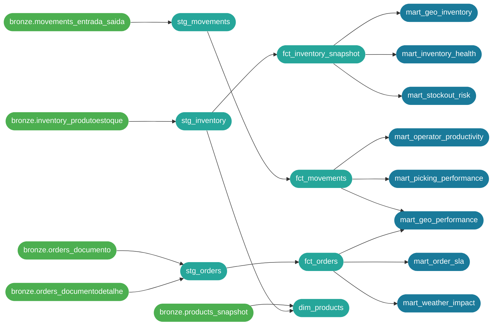

# WMS Data Platform

Plataforma de dados moderna construída sobre Oracle WMS, cobrindo o ciclo completo de engenharia de dados: extração incremental via CDC-like watermark, arquitetura medallion no PostgreSQL local, transformações dbt, serving via FastAPI e camada de agentes de IA conversacional com RAG.

> A stack local roda via Docker Compose. A extração de dados reais requer acesso VPN ao Oracle WMS (host `172.31.200.25`, service `WMS`).

---

## Diagrama de Arquitetura



---

## Quick Start (dados de demonstração)

```bash
git clone https://github.com/leandrolps/wms-data-platform.git
cd wms-data-platform

cp .env.example .env          # preencha ANTHROPIC_API_KEY

make up                       # sobe PostgreSQL, Qdrant, MinIO, Airflow, Grafana e API
make dbt-run-demo             # seed bronze → dbt run (marts analíticos)
```

## Quick Start (dados reais — requer VPN + Oracle)

```bash
cp .env.example .env          # preencha ANTHROPIC_API_KEY + credenciais Oracle

make up
make extract-full             # extrai 90 dias do Oracle WMS → bronze
make dbt-run                  # roda dbt sobre os dados extraídos

# Indexa ADRs/runbooks no Qdrant para o ResearchAgent
python3 pipelines/rag/embed_docs.py --docs-dir docs --qdrant-url http://localhost:6333
```

### Serviços disponíveis após `make up`

| Serviço | URL |
|---|---|
| API FastAPI | http://localhost:8000 |
| Chat (UI) | http://localhost:8000/chat |
| Docs interativos | http://localhost:8000/docs |
| Grafana | http://localhost:3000 (admin/admin) |
| Airflow | http://localhost:8080 (admin/admin) |
| MinIO Console | http://localhost:9001 |
| Qdrant Dashboard | http://localhost:6333/dashboard |

---

## Arquitetura

### dbt Lineage Graph



### Stack Completa

```
Oracle WMS (172.31.200.25)
  └─[watermark]─► oracle_to_postgres.py ──► PostgreSQL — schema bronze
                                                    │
                                             dbt Core (target: local)
                                                    │
                                             schema silver  ← staging views
                                                    │
                                             schema gold    ← 8 marts analíticos
                                                    │
                              ┌─────────────────────┤
                           Agentes IA            Grafana
                      AnalystAgent (SQL)      WMS Operations
                      ResearchAgent (RAG)     Overview Dashboard
                      ReporterAgent (síntese)
                              │
                         FastAPI /chat
                              │
                     HTML Chat UI (localhost:8000/chat)
```

### Tabelas Oracle extraídas

| Tabela Oracle | Bronze PostgreSQL | Modo | Volume |
|---|---|---|---|
| `ORAINT.DOCUMENTO` | `bronze.orders_documento` | watermark (DATAEMISSAO) | ~4.200 docs/90d |
| `WMAS.ESTOQUEPRODUTO` | `bronze.inventory_produtoestoque` | snapshot | 4 posições |
| `WMAS.MOVIMENTOENTRADASAIDA` | `bronze.movements_entrada_saida` | watermark (DATAHISTORICO) | ~870k movim/90d |
| `ORAINT.PRODUTO` | `bronze.products_snapshot` | snapshot | 5.376 produtos |

---

## Status por Camada

### ✅ Infraestrutura Local (Docker Compose)

- PostgreSQL 16 com schemas `bronze`, `silver`, `gold` provisionados via `docker/postgres/init.sql`
- Qdrant v1.9 para vector store local
- MinIO para object storage local
- Airflow 2 com LocalExecutor
- Grafana com datasource PostgreSQL e dashboard WMS Operations Overview
- FastAPI com hot-reload montado como volume

---

### ✅ Bronze (PostgreSQL local)

Populado via extração Oracle real ou `make seed` (dados de demonstração).

| Tabela | Descrição |
|---|---|
| `bronze.orders_documento` | Documentos de saída (NF, OS, TE) — chave: `SEQUENCIAINTEGRACAO` |
| `bronze.inventory_produtoestoque` | Posição de estoque por produto/armazém |
| `bronze.movements_entrada_saida` | Movimentações entrada/saída — fonte: `WMAS.MOVIMENTOENTRADASAIDA` |
| `bronze.products_snapshot` | Snapshot de cadastro de produtos |

---

### ✅ Silver (dbt + PostgreSQL)

- dbt Core rodando contra PostgreSQL local (`target: local`)
- Macros de compatibilidade cross-db em `macros/compat.sql` — mesmos modelos rodam em PostgreSQL, DuckDB e Glue/Spark

| Modelo | Tipo | Chave |
|---|---|---|
| `stg_orders` | view | `order_id` (SEQUENCIAINTEGRACAO) |
| `stg_inventory` | view | `inventory_id` |
| `stg_movements` | view | `movement_id` |
| `fct_orders` | incremental | `order_id` |
| `fct_inventory_snapshot` | incremental | `inventory_id` |
| `fct_movements` | incremental | `movement_id` |
| `dim_products` | incremental | `product_id` |

---

### ✅ Gold — 8 Marts Analíticos

Todos implementados e rodando com dados reais do Oracle WMS.

| Mart | Descrição | Dados reais |
|---|---|---|
| `mart_picking_performance` | Produtividade por operador e turno | ✅ 3.746 linhas |
| `mart_operator_productivity` | Ranking com contexto de complexidade | ✅ 4.079 linhas |
| `mart_order_sla` | Tempo de ciclo e aderência ao prazo | ✅ (pedidos pendentes) |
| `mart_inventory_health` | Giro, cobertura e risco de ruptura | ✅ 4 posições |
| `mart_stockout_risk` | Projeção de ruptura por SKU | ✅ 4 SKUs |
| `mart_geo_performance` | SLA por empresa/depositante/mês | ✅ |
| `mart_geo_inventory` | Cobertura de estoque por região | ✅ |
| `mart_weather_impact` | Correlação atraso × clima (pendente enriquecimento) | ⚠️ vazio |

---

### ✅ Agentes IA (end-to-end funcionando)

Stack: CrewAI + Claude (Anthropic API) + PostgreSQL (gold) + Qdrant (RAG)

| Agent | Arquivo | Função |
|---|---|---|
| `AnalystAgent` | `app/agents/analyst_agent.py` | Gera e executa SQL sobre marts gold |
| `ResearchAgent` | `app/agents/research_agent.py` | RAG sobre 86 chunks de ADRs/runbooks via Qdrant |
| `ReporterAgent` | `app/agents/reporter_agent.py` | Síntese executiva em Markdown estruturado |
| `WMSCrew` | `app/agents/wms_crew.py` | Orquestra os três agentes em sequência |

**Qdrant:** 86 vetores indexados (18 docs: 3 ADRs, 1 runbook, arquitetura, contratos).  
**Perguntas de exemplo:**
- "Quais empresas têm mais pedidos?"
- "Por que o projeto usa Iceberg em vez de Delta Lake?"
- "Qual o desempenho dos operadores esta semana?"
- "Como recuperar o pipeline em caso de falha?"

---

### ✅ Grafana Dashboard

Dashboard **WMS Operations Overview** com 8 painéis:
- Produtos em Risco Crítico, Total de Pedidos, Pedidos em Aberto, Produtos Cadastrados
- Top Produtos — Risco de Ruptura (tabela)
- Distribuição de Risco por Armazém (bar chart)
- Pedidos por Tipo de Documento
- Volume de Pedidos por Mês (SLA %)

---

### ✅ RAG — Qdrant Indexado

Script `pipelines/rag/embed_docs.py` indexa todos os docs em `docs/`:

```bash
python3 pipelines/rag/embed_docs.py --docs-dir docs --qdrant-url http://localhost:6333
```

Modelo: `BAAI/bge-base-en-v1.5` (768 dims, FastEmbed). Coleção: `wms_operational_docs`.

---

### ⚠️ Orquestração Airflow (stubs)

6 DAGs com estrutura definida — lógica interna pendente:

| DAG | Schedule |
|---|---|
| `dag_extract_wms.py` | diário 01h |
| `dag_transform_dbt.py` | diário 03h |
| `dag_quality_check.py` | diário 04h |
| `dag_load_warehouse.py` | diário 04h30 |
| `dag_embed_rag.py` | semanal |
| `dag_freshness_monitor.py` | horário |

---

### ❌ Enriquecimento Geográfico/Climático

Pendente para `mart_geo_performance` completo e `mart_weather_impact`:
- ViaCEP — CEP → cidade, estado, coordenadas
- IBGE — dados demográficos por município
- INMET — histórico climático por cidade/data
- ANTT — dados de transportadoras

---

### ❌ Frontend React

Não iniciado. Previsto: `ChatInterface`, `InventoryDashboard`, `OperationsDashboard`.

---

## Roadmap

```
CONCLUÍDO
─────────────────────────────────────────────────
✅ Docker Compose (PostgreSQL, Qdrant, MinIO, Airflow, Grafana, API)
✅ Extração Oracle real: 4.176 pedidos, 869k movimentos, 5.376 produtos
✅ Bronze — tabelas, seed demo e extração watermark
✅ Silver — 7 modelos dbt (staging + fct + dim)
✅ Gold — 8 marts analíticos com dados reais
✅ dbt cross-db compat (PostgreSQL, DuckDB, Glue/Spark)
✅ Agentes IA end-to-end (AnalystAgent + ResearchAgent + ReporterAgent)
✅ RAG — 86 chunks indexados (ADRs, runbooks, arquitetura)
✅ API FastAPI com rota /chat + HTML chat UI
✅ Grafana dashboard com dados reais

EM ANDAMENTO
─────────────────────────────────────────────────
⬜ DAGs Airflow — implementar lógica interna
⬜ mart_order_sla — mapear delivered_at no Oracle
⬜ Testes de integração dos agentes (DeepEval)

PRÓXIMOS PASSOS
─────────────────────────────────────────────────
⬜ Enriquecimento — ViaCEP, IBGE, INMET, ANTT
⬜ Frontend React — ChatInterface + dashboards
⬜ CI/CD — GitHub Actions (lint, test, dbt compile)
⬜ Observabilidade — LangFuse traces, DeepEval evals
⬜ Deploy AWS — Terraform, Lambda, Redshift Serverless
```

---

## Stack

| Camada | Tecnologia |
|---|---|
| Linguagem | Python 3.11+ |
| Banco de dados | PostgreSQL 16 (bronze / silver / gold) |
| Object storage | MinIO (local) |
| Transformação | dbt Core 1.10 + dbt-postgres |
| Agentes | CrewAI + Claude (Anthropic API) |
| Vector store | Qdrant v1.9 (local) |
| API | FastAPI + Uvicorn |
| Orquestração | Apache Airflow 2 (LocalExecutor) |
| Dashboards | Grafana Cloud / local |
| Observabilidade | LangFuse, DeepEval |
| Infra local | Docker Compose |

---

## Estrutura do Repositório

```
docker/
  postgres/
    init.sql              # cria schemas e tabelas bronze
    seed.py               # popula bronze com dados de amostra
  grafana/
    dashboards/           # wms_overview.json
    provisioning/         # datasource PostgreSQL

transform/dbt_wms/
  models/staging/         # 3 views (stg_orders, stg_inventory, stg_movements)
  models/marts/           # 8 marts analíticos gold
  macros/compat.sql       # wms_epoch, wms_hour, wms_today (cross-db)
  profiles.yml            # target local (PostgreSQL) + dev/prod (Glue)

app/
  agents/                 # AnalystAgent, ResearchAgent, ReporterAgent, WMSCrew
  api/                    # FastAPI: main, routes, schemas, services
  requirements.txt
  Dockerfile

pipelines/
  extraction/
    oracle_to_postgres.py # extrai Oracle → bronze (watermark + snapshot)
  rag/
    embed_docs.py         # indexa docs/ no Qdrant (BAAI/bge-base-en-v1.5)
  dags/                   # 6 DAGs Airflow (stubs)
  enrichment/             # ViaCEP, IBGE, INMET, ANTT (pendente)

docs/
  adr/                    # 3 ADRs (Iceberg, CDC, Glue vs Redshift)
  runbooks/               # pipeline-recovery.md
  architecture.md         # arquitetura completa

docker-compose.yml
Makefile
.env.example
```

---

## Comandos Úteis

```bash
# Stack
make up               # sobe todos os serviços
make down             # para e remove containers
make logs             # docker compose logs -f

# Dados demo
make seed             # popula bronze com seed
make dbt-run-demo     # seed + dbt run

# Dados reais (requer VPN + Oracle)
make extract-full     # extração full 90 dias Oracle → bronze
make extract          # extração incremental
make dbt-run          # dbt run sobre bronze atual
make pipeline-real    # clean-bronze + extract-full + dbt-run

# dbt
make dbt-test         # dbt test
make dbt-docs         # gera e serve dbt docs em localhost:8080

# RAG
# python3 pipelines/rag/embed_docs.py --docs-dir docs --qdrant-url http://localhost:6333
```
