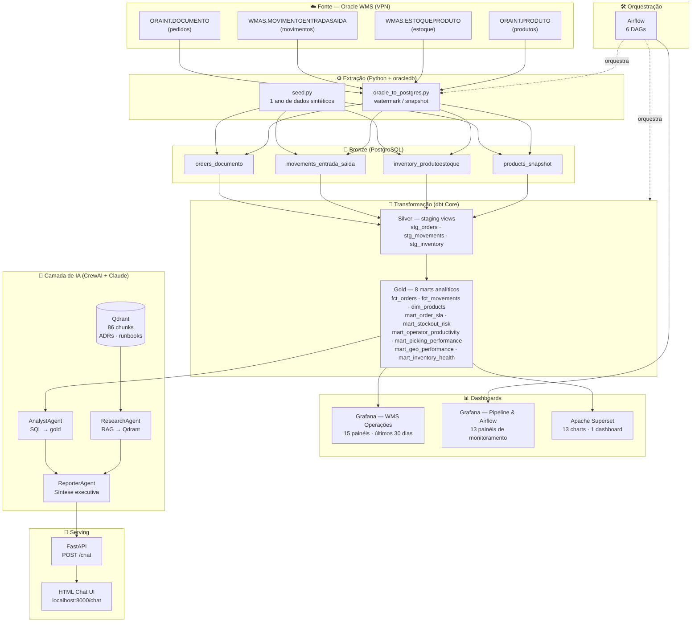
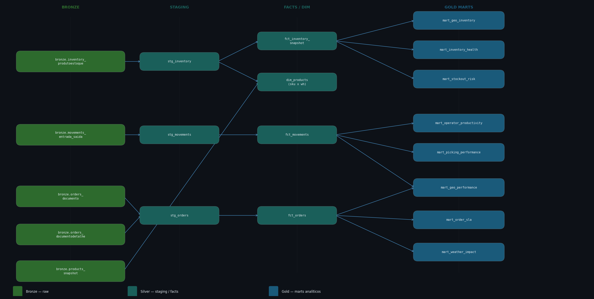
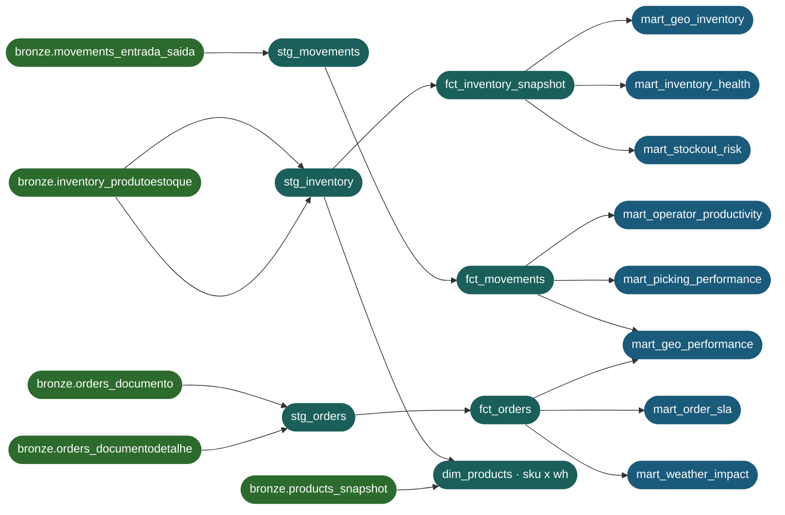

# WMS Data Platform

Plataforma de dados moderna construída sobre Oracle WMS, cobrindo o ciclo completo de engenharia de dados: extração incremental com watermark, arquitetura medallion no PostgreSQL local, transformações dbt Core, orquestração Airflow, serving via FastAPI, camada de agentes de IA conversacional com RAG, e dashboards operacionais no Grafana e Apache Superset.

> A stack local roda via Docker Compose. A extração de dados reais requer acesso VPN ao Oracle WMS (host `172.31.200.25`, service `WMS`). O seed de demonstração gera 1 ano de dados sintéticos realistas sem necessidade de Oracle.

---

## Diagrama de Arquitetura



---

## Quick Start (dados de demonstração — sem Oracle)

```bash
git clone https://github.com/leandrolps/wms-data-platform.git
cd wms-data-platform

cp .env.example .env          # preencha ANTHROPIC_API_KEY

docker compose up -d          # sobe todos os serviços

# Gera 1 ano de dados sintéticos (3.703 pedidos, 37.658 movimentos)
python3 docker/postgres/seed.py

# Transforma bronze → silver → gold
docker exec wms-airflow-webserver bash -c \
  "dbt run --full-refresh --project-dir /opt/airflow/dbt_wms --profiles-dir /opt/airflow/dbt_wms"

# Reconstrói dashboard Superset com 13 charts
docker cp scripts/superset_docker_setup.py wms-superset:/tmp/
docker exec -u root wms-superset python3 /tmp/superset_docker_setup.py
```

## Quick Start (dados reais — requer VPN + Oracle)

```bash
cp .env.example .env          # preencha ANTHROPIC_API_KEY + credenciais Oracle

docker compose up -d
make extract-full             # extrai 90 dias do Oracle WMS → bronze
docker exec wms-airflow-webserver bash -c \
  "dbt run --project-dir /opt/airflow/dbt_wms --profiles-dir /opt/airflow/dbt_wms"

# Indexa ADRs/runbooks no Qdrant para o ResearchAgent
python3 pipelines/rag/embed_docs.py --docs-dir docs --qdrant-url http://localhost:6333
```

### Serviços disponíveis após `docker compose up`

| Serviço | URL | Credenciais |
|---|---|---|
| API FastAPI | http://localhost:8000 | — |
| Chat (UI) | http://localhost:8000/chat | — |
| Docs interativos | http://localhost:8000/docs | — |
| **Grafana** | http://localhost:3000 | admin / wmsadmin2026 |
| **Apache Superset** | http://localhost:8088 | admin / admin |
| Airflow | http://localhost:8080 | admin / admin |
| MinIO Console | http://localhost:9001 | minioadmin / minioadmin |
| Qdrant Dashboard | http://localhost:6333/dashboard | — |

---

## Arquitetura por Camada

### Bronze — Extração

| Tabela | Fonte Oracle | Modo | Volume (demo) |
|---|---|---|---|
| `bronze.orders_documento` | `ORAINT.DOCUMENTO` | watermark (DATAEMISSAO) | 3.703 docs |
| `bronze.movements_entrada_saida` | `WMAS.MOVIMENTOENTRADASAIDA` | watermark (DATAHISTORICO) | 37.658 movim. |
| `bronze.inventory_produtoestoque` | `WMAS.ESTOQUEPRODUTO` | snapshot | 450 posições |
| `bronze.products_snapshot` | `ORAINT.PRODUTO` | snapshot | 150 produtos |

### Silver — dbt Staging

| Modelo | Tipo | Descrição |
|---|---|---|
| `stg_orders` | view | Normaliza pedidos — chave: `order_id` |
| `stg_movements` | view | Normaliza movimentos — chave: `movement_id` |
| `stg_inventory` | view | Normaliza estoque — chave: `inventory_id` |
| `fct_orders` | incremental | Fatos de pedidos com valores |
| `fct_movements` | incremental | Fatos de movimentações com operador |
| `fct_inventory_snapshot` | incremental | Snapshot de estoque por data |
| `dim_products` | incremental | Dimensão produto com classe ABC |

### Gold — 8 Marts Analíticos

| Mart | Descrição | Linhas (demo) |
|---|---|---|
| `mart_order_sla` | Tempo de ciclo, SLA e status por pedido — `delivered_at` derivado via proxy `estadomovimento=8` | 5.480 |
| `mart_operator_productivity` | Ranking de operadores com índice de complexidade | 16.236 |
| `mart_picking_performance` | Produtividade por operador e turno (picks/h) | 16.987 |
| `mart_stockout_risk` | Projeção de ruptura de estoque por SKU | 450 |
| `mart_inventory_health` | Cobertura, utilização e risco por produto/armazém | 450 |
| `mart_geo_performance` | SLA por empresa/mês | 260 |
| `mart_geo_inventory` | Cobertura de estoque por região | 27 |
| `mart_weather_impact` | Correlação atraso × clima | 2.779 |

### dbt Lineage



<details>
<summary>Diagrama texto (Mermaid)</summary>



</details>

---

## Dashboards

### Grafana — WMS Mapa Geográfico (`wms_geo.json`)

Dashboard geográfico com **7 painéis**:

| Painel | Tipo | Métrica |
|---|---|---|
| Mapa SLA por Estado | geomap | SLA % por UF (choropleth) |
| Ranking SLA por Estado | table | UF × pedidos × SLA % |
| Armazéns e Empresas | geomap | Localização dos armazéns e empresas |
| Detalhes por Armazém | table | Warehouse × cidade × UF |
| Chuva × Atraso (série temporal) | timeseries | Precipitação × pedidos atrasados por dia |
| SLA por Macro-Região | bar chart | Norte / Nordeste / Centro-Oeste / Sudeste / Sul |
| Temperatura Média por UF | timeseries | °C por estado nos últimos 30 dias |

### Grafana — WMS Operações (`wms_operations.json`)

Dashboard operacional com **15 painéis** e range padrão de **30 dias**:

| Painel | Tipo | Métrica |
|---|---|---|
| Total de Pedidos | stat | COUNT fct_orders |
| Pedidos em Aberto | stat (azul) | sla_status = pending |
| Pedidos Atrasados | stat (vermelho) | sla_status = late |
| Total de Movimentos | stat | COUNT fct_movements |
| Produtos em Risco Crítico | stat (vermelho) | risk_level IN (critical, stockout) |
| SLA % no Prazo | stat (verde/amarelo/vermelho) | on_time + on_time_express / total fechado |
| Movimentações por Dia | timeseries (w=16) | DATE_TRUNC diário com `$__timeFilter` — últimos 30 dias |
| SLA por Status | piechart donut | Express / No Prazo / Em Risco / Atrasado / Pendente |
| Volume de Pedidos por Mês | table | 12 meses × empresa × SLA % |
| Faturamento Mensal | table | Últimos 90 dias em R$ |
| Pedidos por Tipo de Documento | table | NF / OS / TE / RE × empresa |
| Top Operadores — Produtividade | table | Movimentos / Qtd por mov / Complexidade |
| Backlog por Faixa de Aging | table | 0-7d / 7-30d / 30-90d / >90d |
| Pedidos em Aberto Mais Antigos | table | Top 15 mais antigos com aging em horas |
| Risco de Stockout por Produto | table | SKU × classe × dias até ruptura × risco colorido |

### Grafana — Pipeline & Airflow (`wms_pipeline.json`)

Dashboard de monitoramento de infraestrutura com **13 painéis**:

**Seção Airflow** (datasource: `airflow` DB):
- DAG Runs últimas 24h / Sucessos / Falhas / Em Execução
- Histórico de DAG Runs (últimas 30 execuções)
- Task Instances — últimas falhas
- Duração média por task (7 dias)

**Seção ETL Bronze** (datasource: `wms` DB):
- 4 stats de contagem de linhas por tabela bronze
- Última carga por tabela (timestamp de `_cdc_loaded_at`)

**Seção Silver & Gold**:
- Row counts de todas as tabelas silver e gold via `pg_stat_user_tables`

### Apache Superset — WMS Operations

Dashboard com **13 charts** construídos via manipulação direta do SQLite de metadados:


O dashboard do Superset complementa o Grafana com uma visão mais analítica da operação, destacando:
- KPIs executivos de pedidos, movimentações, SLA e backlog
- Séries temporais de volume operacional ao longo do ano
- Tabelas analíticas para pedidos, operadores, risco de stockout e picking
- Gráficos de distribuição para SLA e risco de estoque

| Chart | Tipo | Dataset |
|---|---|---|
| Total de Pedidos | big_number_total | fct_orders |
| Total de Movimentos | big_number_total | fct_movements |
| SLA % no Prazo | big_number_total | mart_order_sla |
| Pedidos em Aberto | big_number_total | mart_order_sla |
| Movimentações por Dia | echarts_timeseries_line | fct_movements |
| SLA por Status | pie (donut) | mart_order_sla |
| Volume de Pedidos por Mês | table | mart_order_sla |
| Pedidos por Tipo de Documento | table | fct_orders |
| Top Operadores — Produtividade | table | mart_operator_productivity |
| Ranking Operadores Top 15 | table | mart_operator_productivity |
| Risco de Stockout por Produto | table | mart_stockout_risk |
| Distribuição de Risco de Estoque | pie (donut) | mart_stockout_risk |
| Saúde do Inventário | table | mart_inventory_health |
| Performance de Picking por Turno | table | mart_picking_performance |

> **Script de reconstrução:** `scripts/superset_docker_setup.py`  
> Roda via `docker exec -u root wms-superset python3 /tmp/superset_docker_setup.py` (após `docker cp`)

---

## Seed — 1 Ano de Dados Sintéticos

O script `docker/postgres/seed.py` gera dados realistas sem necessidade de Oracle:

| Dimensão | Volume |
|---|---|
| Pedidos | ~3.700 (abr/2025 → abr/2026) |
| Movimentos | ~37.600 |
| Inventário | 450 posições (50 SKUs × 3 armazéns × 3 empresas) |
| Produtos | 50 SKUs (15 classe A · 20 classe B · 15 classe C) |
| Operadores | 20 (nomes brasileiros reais) |
| Empresas | 5 |

**Padrões realistas gerados:**
- **Sazonalidade:** Q4 (out–dez) 50% acima da média, fim de semana 70% menor
- **Valores:** distribuição log-normal (mediana ~R$ 3k, cauda longa até R$ 100k+)
- **SLA:** ~15% express (<12h), ~55% no prazo, ~12% atrasado, ~18% pendente (demo sintético)
- **Produtos ABC:** classe A com alto consumo diário (15–50 un/dia), C com baixo (1–8 un/dia)
- **Inserção em batches** de 5.000 linhas para estabilidade de memória

> **Dados reais Oracle:** Com extração de 1 ano via `make pipeline-real`, a distribuição SLA real observada é ~43% express, ~8% no prazo, ~8% em risco, ~39% atrasado, ~2% pendente. O `DATAENTREGA` não é preenchido nesta instalação Oracle WMS — a data de entrega é derivada via proxy: primeiro movimento de saída (`estadomovimento = 8`) do mesmo depositante após a emissão do pedido.

---

## Agentes IA

Stack: **CrewAI** + **Claude (Anthropic API)** + PostgreSQL gold + Qdrant RAG

### Arquitetura dos Agentes

```
Pergunta do usuário
       │
       ▼
┌─────────────────────┐
│   WMS Data Analyst  │  ← Claude via Anthropic API
│   (AnalystAgent)    │    Executa SQL no schema gold
└────────┬────────────┘
         │ dados quantitativos
         ▼
┌──────────────────────────┐
│ WMS Operations Researcher│  ← Claude via Anthropic API
│   (ResearchAgent)        │    Busca semântica no Qdrant
└────────┬─────────────────┘    (runbooks, ADRs, incidentes)
         │ contexto operacional
         ▼
┌──────────────────────────┐
│  WMS Operations Reporter │  ← Claude via Anthropic API
│   (ReporterAgent)        │    Síntese executiva em Markdown
└────────┬─────────────────┘
         │ resposta final
         ▼
     FastAPI /chat/stream (SSE)
```

### Agentes

| Agente | Nome no CrewAI | Arquivo | Função |
|---|---|---|---|
| `AnalystAgent` | WMS Data Analyst | `app/agents/analyst_agent.py` | Identifica marts relevantes, gera e executa SQL no schema gold, interpreta resultados |
| `ResearchAgent` | WMS Operations Researcher | `app/agents/research_agent.py` | Busca semântica no Qdrant por runbooks, ADRs e incidentes passados relacionados à pergunta |
| `ReporterAgent` | WMS Operations Reporter | `app/agents/reporter_agent.py` | Sintetiza dados quantitativos + contexto operacional em resposta estruturada (Resumo Executivo · Dados Chave · Contexto · Recomendações) |
| `WMSCrew` | crew | `app/agents/wms_crew.py` | Orquestra os três agentes em sequência via CrewAI |

### LLM e Embeddings

| Componente | Modelo | Provedor |
|---|---|---|
| LLM dos agentes | Claude (Anthropic API) | Anthropic — configurar `ANTHROPIC_API_KEY` |
| Embeddings Qdrant | `BAAI/bge-base-en-v1.5` (768 dims) | FastEmbed — local, sem custo |
| Memória CrewAI (Chroma) | `text-embedding-3-small` | OpenAI — requer `OPENAI_API_KEY` |

> **Nota:** A memória entre sessões (Chroma) usa embeddings da OpenAI. Para rodar sem `OPENAI_API_KEY`, o `WMSCrew` detecta automaticamente a ausência da variável e inicializa com `memory=False`.

### Qdrant — Knowledge Base

Coleção `wms_operational_docs` — modelo `BAAI/bge-base-en-v1.5` (768 dims, FastEmbed).

Indexar documentos:
```bash
python3 pipelines/rag/embed_docs.py \
  --docs-dir docs \
  --qdrant-url http://localhost:6333
```

Conteúdo indexado: ADRs de arquitetura, runbooks de recuperação de pipeline, documentação técnica da plataforma.

### Ferramentas dos Agentes

| Tool | Agente | Descrição |
|---|---|---|
| `wms_sql_analyst` | AnalystAgent | Executa queries SQL no PostgreSQL schema gold |
| `wms_operational_knowledge_search` | ResearchAgent | Busca semântica vetorial no Qdrant |
| `search_memory` | Todos | Recupera contexto da memória compartilhada (Chroma) |

### Perguntas de exemplo

- "Qual a saúde geral do estoque por armazém?"
- "Quais empresas têm mais pedidos atrasados este mês?"
- "Qual o desempenho dos operadores esta semana?"
- "Qual o tamanho da base gold?"
- "Como recuperar o pipeline em caso de falha do dbt?"

---

## Orquestração Airflow

6 DAGs com ordem de execução:

```
dag_extract_wms       → 01h  — extração Oracle → bronze
dag_transform_dbt     → 03h  — dbt run (silver + gold)
dag_quality_check     → 04h  — testes dbt
dag_embed_rag         → semanal — re-indexa docs no Qdrant
dag_freshness_monitor → horário — alerta de frescor dos dados
dag_enrich_geo        → semanal (seg 03h) — ViaCEP + IBGE + Open-Meteo → geo_reference + weather_daily
```

> Oracle não acessível localmente: `check_oracle_conn` e `wait_for_extract` falham por design. Para rodar o dbt sem Airflow: `docker exec wms-airflow-webserver bash -c "dbt run --full-refresh --project-dir /opt/airflow/dbt_wms --profiles-dir /opt/airflow/dbt_wms"`

---

## Estrutura do Repositório

```
docker/
  postgres/
    init.sql              # cria schemas bronze, silver, gold e tabelas
    seed.py               # gera 1 ano de dados sintéticos realistas
  grafana/
    dashboards/
      wms_operations.json # dashboard operacional WMS (15 painéis, range 30d)
      wms_pipeline.json   # monitoramento Airflow + ETL (13 painéis)
      wms_geo.json        # mapa geográfico SLA + clima (7 painéis)
    provisioning/
      datasources/
        postgres.yml          # datasource WMS PostgreSQL
        airflow_postgres.yml  # datasource Airflow PostgreSQL

scripts/
  superset_docker_setup.py  # reconstrói Superset do zero: 13 charts + dashboard

transform/dbt_wms/
  models/staging/         # 3 views (stg_orders, stg_inventory, stg_movements)
  models/marts/           # 8 marts analíticos gold
  macros/compat.sql       # wms_epoch, wms_hour, wms_today (cross-db)
  profiles.yml            # target local (PostgreSQL)

app/
  agents/                 # AnalystAgent, ResearchAgent, ReporterAgent, WMSCrew
  api/                    # FastAPI: main, routes, schemas, services
  requirements.txt
  Dockerfile

pipelines/
  extraction/
    oracle_to_postgres.py # extrai Oracle → bronze (watermark + snapshot)
  rag/
    embed_docs.py         # indexa docs/ no Qdrant (BAAI/bge-base-en-v1.5)
  dags/                   # 5 DAGs Airflow
  gold/                   # scripts auxiliares de geração gold

docs/
  adr/                    # ADRs de arquitetura e decisões técnicas
  runbooks/               # pipeline-recovery.md
  architecture.md

docker-compose.yml
Dockerfile.airflow
Makefile
.env.example
```

---

## Status

```
✅ CONCLUÍDO
──────────────────────────────────────────────────────────────
✅ Docker Compose — PostgreSQL, Qdrant, MinIO, Airflow, Grafana,
                    Superset, FastAPI
✅ Bronze — init.sql, seed demo (1 ano), extração watermark Oracle
✅ Silver — 7 modelos dbt (staging views + fct + dim)
✅ Gold — 8 marts analíticos, dbt cross-db compat
✅ Grafana — 3 dashboards (Operações · Pipeline/Airflow · Mapa Geográfico)
✅ Superset — 13 charts, dashboard reconstruído via script
✅ Seed 1 ano — sazonalidade, ABC, 20 operadores, SLA distribuído
✅ Agentes IA — AnalystAgent + ResearchAgent + ReporterAgent (end-to-end)
✅ RAG — 86 chunks indexados (ADRs, runbooks, arquitetura)
✅ API FastAPI — rota /chat + HTML chat UI
✅ Enriquecimento geográfico — ViaCEP + IBGE + Open-Meteo, DAG semanal,
                               tabelas geo_reference e weather_daily,
                               JOINs nos marts geo/weather

⬜ EM ANDAMENTO / PRÓXIMOS PASSOS
──────────────────────────────────────────────────────────────
⬜ DAGs Airflow — implementar lógica interna completa
⬜ Observabilidade — LangFuse traces nos agentes, DeepEval evals
⬜ Frontend React — ChatInterface + dashboards interativos
⬜ CI/CD — GitHub Actions (lint, test, dbt compile, security scan)
⬜ Melhorar a experiência local no Mac com mais automações Docker
```

---

## Stack

| Camada | Tecnologia |
|---|---|
| Linguagem | Python 3.11+ |
| Banco de dados | PostgreSQL 16 (bronze / silver / gold) |
| Object storage | MinIO (local) |
| Transformação | dbt Core 1.10 + dbt-postgres |
| Agentes | CrewAI + Claude (Anthropic API) |
| Vector store | Qdrant v1.9 |
| API | FastAPI + Uvicorn |
| Orquestração | Apache Airflow 2 (LocalExecutor) |
| Dashboards | Grafana + Apache Superset |
| Observabilidade | LangFuse, DeepEval |
| Infra local | Docker Compose |

---

## Comandos Úteis

```bash
# Stack
docker compose up -d          # sobe todos os serviços
docker compose down           # para e remove containers
docker compose logs -f        # acompanha logs

# Seed e transformação
python3 docker/postgres/seed.py   # gera 1 ano de dados sintéticos
docker exec wms-airflow-webserver bash -c \
  "dbt run --full-refresh --project-dir /opt/airflow/dbt_wms \
            --profiles-dir /opt/airflow/dbt_wms"

# Superset — reconstrói dashboard do zero
docker cp scripts/superset_docker_setup.py wms-superset:/tmp/
docker exec -u root wms-superset python3 /tmp/superset_docker_setup.py

# Dados reais (requer VPN + Oracle)
make extract-full             # extração full 90 dias Oracle → bronze
make extract                  # extração incremental
make dbt-run                  # dbt run sobre bronze atual
make pipeline-real            # clean-bronze + extract-full + dbt-run

# RAG
python3 pipelines/rag/embed_docs.py \
  --docs-dir docs \
  --qdrant-url http://localhost:6333
```
